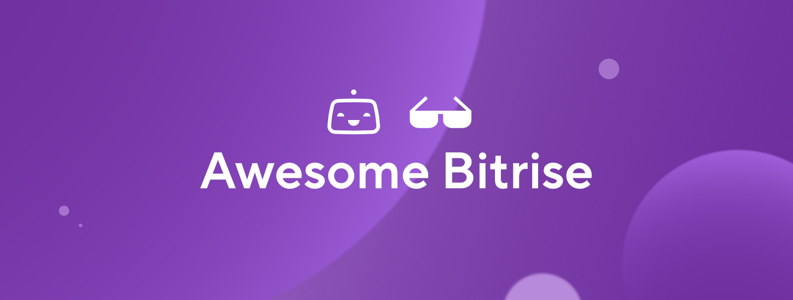

# Awesome Bitrise 
A curated list of blogs, videos, tutorials, code, tools &amp; scripts, related to the design and implementation of mobile apps and solutions and in Bitrise.
Inspired by the [awesome](https://github.com/sindresorhus/awesome) list

    <kbd>
        
    </kbd>

Here you will find everything you need to help you start your **[Bitrise](https://www.bitrise.io/)** journey and quickly get up and running when it comes to building, testing, and deploying that empowers mobile developers around the world.

> Community [contributions](contributing.md) are most welcome! Feel free to submit a **pull request** with any adds/removes/changes to content!

## Contents

- [Official](#Official)
  - [Docs](#Official-Docs)
  - [Business and Tech Reports](#Official-Business-and-Tech-Reports)
  - [Videos](#Official-Videos)
  - [Announcements and Articles](#Official-Announcements-and-Articles)
  - [Repositories and Tools](#Official-Repositories-and-Tools)
  - [Forums and Feedback](#Official-Forums-and-Feedback)
  - [Official Podcasts](#Official-Podcasts)
  - [Events](#Events)
  - [Webinars](#Recorded-Webinars)
- [Community](#Community)
  - [Videos](#Community-Videos)
  - [Articles](#Community-Articles)
  - [Tools](#Community-Tools)
  - [Repositories](#Community-Repositories)
  - [Community and Support](#Community-and-Support)

## Official

> Links below are from official Bitrise sources, websites, and channels.

### Official Docs
- [Bitrise documentation](https://devcenter.bitrise.io/)
- [Knowledge Base](https://support.bitrise.io/hc/en-us/categories/360000108597-Knowledge-Data-Base-)
- [Support Center](https://support.bitrise.io/hc/en-us)

### Official Business and Tech Reports
- [Mobile Product Success in Finance and Banking report, 2022 edition](https://www.bitrise.io/downloads/mobile-product-success-in-finance-report-2022)
- [Mobile Product Success in Finance and Banking report, 2022 edition - Japanese edition](https://www.bitrise.io/downloads/japan-mobile-product-success-in-finance-report-2022)
- ["Mobile Product Success in Shopping, 2021",  report](https://go.bitrise.io/downloads/state-of-mobile-shopping-apps-2021)
- [How mobile release trains drive speed and quality for the world's biggest apps](https://www.bitrise.io/downloads/release-train)
- [Maximizing mobile engineering efficiency through Gen2 and Velocity](https://www.bitrise.io/downloads/mobile-engineering-efficiency-gen2-report)
- [Maximizing mobile engineering efficiency through Gen2 and Velocity - Japanese edition](https://www.bitrise.io/downloads/gen2-report-japan)
- [The 5 main benefits of switching from Jenkins to cloud CI](https://www.bitrise.io/downloads/5-benefits-switching-from-jenkins?utm_source=website&utm_medium=whitepapers&utm_campaign=Jenkins2021)
- [Mobile CI after Jenkins — 6 lessons learned](https://www.bitrise.io/downloads/mobile-ci-after-jenkins)
- [Mobile CI after Jenkins — 6 lessons learned - Japanese edition](https://www.bitrise.io/downloads/mobile-ci-after-jenkins-6-lessons-jp?utm_source=website&utm_medium=whitepapers&utm_campaign=Jenkins2021)
- [How finance and banking challengers develop and win on mobile](https://www.bitrise.io/downloads/mobile-finance-and-banking-report-2020)
- [How to skip code freezes and release with confidence instead](https://www.bitrise.io/downloads/code-freezes-in-mobile-shopping)

### Official Videos
- [Working at Bitrise](https://www.youtube.com/playlist?list=PLbKJc0NMPDrAD5gLEpPxrJEhhyhJD_NUO)
- [Bitrise Tutorials](https://www.youtube.com/watch?v=7vluGcDNfEA&list=PLbKJc0NMPDrDZ1EMV8Oa5lVRHmyGEfLj2)
- [Bitrise: Where great mobile apps are made](https://www.youtube.com/watch?v=tLtZrV9e0Qo&list=PLbKJc0NMPDrCBM_uB029jcdk-5Wp0tTSa)
- [Build Insights](https://www.youtube.com/watch?v=3PIrOy_vyEY&list=PLbKJc0NMPDrD5W37sNLD72Mzq0fI_efc0)
- [Bitrise Feature Updates](https://www.youtube.com/playlist?list=PLbKJc0NMPDrC68HEane5XvyuCUWPFoa6e)
- [Mobile DevOps is a Thing! | PODCAST](https://www.youtube.com/watch?v=C6n8qurRhmc&list=PLbKJc0NMPDrA7iAkerG9CoqA-8pR5Foql)
- [The road to #WWDC2021](https://www.youtube.com/watch?v=GHTcfENP3XM&list=PLbKJc0NMPDrAFqAhPPUkCRzvBTlraB5p-)
- [Google IO 2021](https://www.youtube.com/watch?v=czItZuchiSA&list=PLbKJc0NMPDrCyHiPE-VRo9OcAxyQ5TxmW)
- [Mobile apps at scale](https://www.youtube.com/watch?v=HrUTfurQE2M&list=PLbKJc0NMPDrB5_mPzh1S63AjjN4yYGE-5)
- [Verified Steps on Bitrise: Accelerate mobile development with Bitrise integrations](https://www.youtube.com/watch?v=mp2iyvJq__Q&list=PLbKJc0NMPDrBtbVmMFRBbo56wPG3o8B8L)
- [Webinars](https://www.youtube.com/watch?v=qz9XiLnkTrY&list=PLbKJc0NMPDrDj-7MB2QrKvoYxB3Un1oEz)
- [Customer Success Stories](https://www.youtube.com/watch?v=aO4VP3Gjp7w&list=PLbKJc0NMPDrCiOTtwdu5T4E9dI7Un2ygo)
- [The Road to MobileDevTestOps - Kobiton Odyssey 2021](https://www.youtube.com/watch?v=ddgwQlL_RBk)

### Official Announcements
- [Announcements](https://support.bitrise.io/hc/en-us/sections/360005429678-Announcements)

### Official Articles - (Categories)
- [Customer Stories](https://www.bitrise.io/customer-stories)
- [Company](https://blog.bitrise.io/categories/company)
- [App development](https://blog.bitrise.io/categories/app-development)
- [Insights](https://blog.bitrise.io/categories/insights)
- [Mobile DevOps](https://blog.bitrise.io/categories/mobile-devops)
- [Releases](https://blog.bitrise.io/categories/releases)
- [Community](https://blog.bitrise.io/categories/community)
- [Bitrise Japanese](https://blog.bitrise.io/language/japanese)
- [Bitrise Hungarian](https://blog.bitrise.io/language/magyar)

### Official Repositories and Tools
- [Official GitHub Repository](https://github.com/bitrise-io)
- [Workflow Recipes](https://github.com/bitrise-io/workflow-recipes)
- [Bitrise StepLib](https://github.com/bitrise-io/bitrise-steplib)
- [Bitrise Webhooks](https://github.com/bitrise-io/bitrise-webhooks)
- [Bitrise Workflow Editor](https://github.com/bitrise-io/bitrise-workflow-editor)
- [Bitrise Code Samples and Examples](https://github.com/bitrise-dev)
- [Bitrise Integration Steps](https://www.bitrise.io/integrations/steps/)
- [Bitrise CLI](https://app.bitrise.io/cli)
- [Bitrise Partner Program](https://www.bitrise.io/partnership)

### Official Forums
- [Bitrise Discussions](https://discuss.bitrise.io/categories)

### Official Podcasts - Mobile DevOps is a thing!
- [What does mobile development look like in a leading UK bank? — with NatWest's Adam Law](https://anchor.fm/bitrise/episodes/Building-a-mobile-app-for-a-leading-bank-with-Adam-Law-from-NatWest-e1gh80f/a-a7m3694)
- [All about test automation: tools and best practices with Angie Jones](https://anchor.fm/bitrise/episodes/All-about-test-automation-tools-and-best-practices-with-Angie-Jones-e1bcdj5/a-a7213jk)
- [The roadmap to mobile success with Peter-John Welcome](https://anchor.fm/bitrise/episodes/The-roadmap-to-mobile-success-with-Peter-John-Welcome-e172kds/a-a6g3vlt)
- [Mastering continuous deployment with Keegan Rush](https://anchor.fm/bitrise/episodes/Mastering-continuous-deployment-with-Keegan-Rush-e14e0hf/a-a64nj2o)
- [Build secure mobile applications with Anastasiia Voitova](https://anchor.fm/bitrise/episodes/Build-secure-mobile-applications-with-Anastasiia-Voitova-e121fob/a-a5oocrg)
- [Building mobile infrastructure with Russell Stephens](https://anchor.fm/bitrise/episodes/Building-mobile-infrastructure-with-Russell-Stephens-esn3sl/a-a4ut7og)
- [App Performance Monitoring with Rasmus Larsson](https://anchor.fm/bitrise/episodes/App-Performance-Monitoring-with-Rasmus-Larsson-en5g40/a-a404brt)
- [Fintech, Flutter, and tech leadership with GDE Mariano Zorrilla](https://anchor.fm/bitrise/episodes/Fintech--Flutter--and-tech-leadership-with-GDE-Mariano-Zorrilla-eja20f/a-a362gu7)
- [Optimizing iOS workflows with Marcos Griselli](https://anchor.fm/bitrise/episodes/Optimizing-iOS-workflows-with-Marcos-Griselli-ehim5p/a-a2rjgmi)
- [How to level up your team’s skill set with John Sundell](https://anchor.fm/bitrise/episodes/How-to-level-up-your-teams-skill-set-with-John-Sundell-eg324v/a-a2j6cfd)
- [Remote work & Mobile DevOps with Joe Birch](https://anchor.fm/bitrise/episodes/Remote-work--Mobile-DevOps-with-Joe-Birch-ee7gh8/a-a27qrpt)
- [Does mobile need its own DevOps? with Vladimir Ivanov](https://anchor.fm/bitrise/episodes/Does-mobile-need-its-own-DevOps--with-Vladimir-Ivanov-ecarmi/a-a1rfm79)

> Mobile DevOps is a thing! is also available on these platforms
- [Apple Podcast](https://podcasts.apple.com/us/podcast/mobile-devops-is-a-thing/id1506647132?uo=4)
- [Google Podcast](https://podcasts.google.com/feed/aHR0cHM6Ly9hbmNob3IuZm0vcy8xMjJiNGExNC9wb2RjYXN0L3Jzcw==)
- [Spotify](https://open.spotify.com/show/1T7xhZIYqANaXu1UOKrBg8)
- [Stitcher](https://www.stitcher.com/show/mobile-devops-is-a-thing)
- [PocketCasts](https://pca.st/2sirqyml)
- [RadioPublic](https://radiopublic.com/mobile-devops-is-a-thing-WxbLe7)

### Events
One of our favorite activities here at Bitrise is to travel the world and meet our customers or attend and sponsors virtual/online events. Make sure you check out our next destination and join us so you don’t miss out on our swags!

- [Upcoming and Previous Events](https://www.bitrise.io/community/events)

### Recorded Webinars
Access all the recorded webinars from [here](https://www.bitrise.io/community/webinars)

- ["The state of mobile shopping apps in 2021"](https://www.bitrise.io/webinar/state-of-mobile-shopping-apps-2021-webinar)
- [Building Mobile Apps at Scale: 39 Engineering Challenges webinar](https://www.bitrise.io/thank-you/building-mobile-apps-at-scale-webinar)
- [AppGallery and Bitrise: 1 Step, 30 Minutes, Millions of Extra Users](https://go.bitrise.io/webinar/deploy-to-appgallery-with-bitrise?utm_source=webinarspage&utm_medium=web&utm_campaign=deploy-to-appgallery-webinar)
- [WWDC 2021: Expectations vs. Reality — Recap discussion with iOS experts](https://www.youtube.com/watch?v=bL9-sGfFluM)
 

## Community

> Links below are from community sources, websites, and channels.

### Community Videos
- [Culture first - The Untold Story of Bitrise](https://www.youtube.com/watch?v=Q3QtHQdAlDc)
- [Bitrise User Group](https://www.youtube.com/watch?v=SI8rQp8HaQU&list=PLbKJc0NMPDrBWFHrFRYPQvi2LN9aGy3hy)
- [Our community](https://www.youtube.com/watch?v=fyuOEK9VDT8&list=PLbKJc0NMPDrDZj7fZn6m40CSPzFFsEpL-)
- [Community Creations](https://www.youtube.com/watch?v=Ca2PSPK1hXs&list=PLbKJc0NMPDrDSWbPpzmxgEMvYuEx3-qqY)
- [Tips & Tricks for Mobile Developers](https://www.youtube.com/playlist?list=PLbKJc0NMPDrAXSRa07LI2fo69DWonQti3)
- [The Road to Mobile DevOps for Android - Android Worldwide](https://www.youtube.com/watch?v=DqvmMi8wKkg)
- [Scale-up Mobile UI Tests -  Google Cloud Budapes](https://www.youtube.com/watch?v=SqYSongXukA)
- [Continuous Testing and Mobile DevOps - Continuous Testing Meetup Berlin](https://www.youtube.com/watch?v=8IdeUJdx8Xg)
- [Scale-up iOS Automated UI Tests - iOS Conf SG 2022](https://www.youtube.com/watch?v=GhexZke-grA)

### Community Articles
- [Android CI/CD pipeline with Bitrise: Deploy your apps to Google Play Store]( https://labs.armut.com/android-ci-cd-pipeline-with-bitrise-deploy-app-to-google-play-store-6bd95f652f8c)
- [Automated Localization: Localazy ❤Bitrise.io](https://dev.to/localazy/automated-localization-localazy-bitrise-io-3j1l)
- [A Framework For Speedy and Scalable Development Of Android UI Tests](https://doordash.engineering/2020/08/19/speedy-and-scalable-development-of-android-mobile-ui-tests/)
- [Best Practices in iOS App Release](https://medium.com/ne-digital/best-practices-in-ios-app-release-250d018c7e4b)
- [Bitbucket + Bitrise: Configuring Continuous Integration for an iOS app](https://bitbucket.org/blog/bitbucket-bitrise-configuring-continuous-integration-for-an-ios-app)
- [Bitrise Tests Made Easier: Add JIRA Build Step and Forget About Delays in QA Testing](https://www.holdapp.com/blog/bitrise-tests-made-easier-with-jira-build-step)
- [Building (almost) anything on Bitrise using Docker](https://www.oliverbinns.co.uk/2020/07/03/building-almost-anything-on-bitrise-using-docker/)
- [Build a Flutter Android app and deploy it to Google Play using Bitrise CI/CD platform](https://medium.com/geekculture/build-a-flutter-android-app-and-deploy-it-to-google-play-using-bitrise-ci-cd-platform-68de0612ede)
- [Caching with Bitrise and React Native – a Post Mortem](https://blog.mayflower.de/10622-bitrise-caching-react-native.html)
- [Continuous Delivery in iOS Apps using Bitrise](https://medium.com/plus-minus-one/continuous-delivery-in-ios-apps-using-bitrise-2b0deac3e16a)
- [Continuous Integration in iOS Apps using Bitrise](https://medium.com/plus-minus-one/continuous-integration-in-ios-apps-using-bitrise-f461137daefd)
- [Deploy to Huawei AppGallery — Verified Bitrise Step](https://medium.com/huawei-developers/deploy-to-huawei-appgallery-verified-bitrise-step-f4cec6c2b036)
- [Firebase TestLab Continuous UI testing in Android using Bitrise](https://wise4rmgodadmob.medium.com/firebase-testlab-continuous-ui-testing-in-android-using-bitrise-c96b73536604)
- [Getting Started with Bitrise: The Definitive Guide](https://medium.com/backenders-club/getting-started-with-bitrise-the-definitive-guide-e4a9c10d6fae)
- [How to Setup Bitrise to Build and Upload a React Native App to Apple App Store Connect](https://www.bluelabellabs.com/blog/bitrise-react-native-apple-app-store-connect/)
- [How to Set up CI/CD Pipelines for Flutter in Bitrise](https://medium.com/tribalscale/how-to-set-up-ci-cd-pipelines-for-flutter-in-bitrise-3f27b1599562)
- [How to UI Test Push Notifications and Universal Links in the iOS Simulator](https://medium.com/compass-true-north/how-to-ui-test-push-notifications-and-universal-links-in-the-ios-simulator-81cc43b33f81)
- [Huawei AGC Reports 📈— Verified Bitrise Step](https://medium.com/appgallery/huawei-agc-reports-verified-bitrise-step-a9919cc98cda)
- [Improving iOS UI Testing](https://medium.com/expedia-group-tech/improving-ios-ui-testing-ad55470825b4)
- [iOS build, test and deliver using Bitrise — Part 2[TEST]](https://lihao6485.medium.com/ios-build-test-and-deliver-using-bitrise-part-2-test-94c7bc56adc3)
- [Keeping Secrets Safe in Android Projects](https://infinum.com/the-capsized-eight/secrets-android-projects)
- [React Native — CD in Bitrise [Part I — iOS]](https://medium.com/mobile-reality/react-native-cd-in-bitrise-part-i-ios-586756755569)
- [25 Bitrise Integration Steps You Should Know for iOS Apps](https://www.linkedin.com/pulse/25-bitrise-integration-steps-you-should-know-ios-apps-moataz-nabil/)

### Community Tools
- More than 330 [Bitrise Integration Steps](https://github.com/bitrise-io/bitrise-steplib/tree/master/steps)

### Community Repositories
- [Bitrise Repository](https://github.com/search?q=bitrise)
- [Curated list of bitrise projects](https://github.com/jaswanthm/cool-bitrise-projects)
- [Unofficial Client iOS app for bitrise.io](https://github.com/toshi0383/Bitrise-iOS)
- [Unofficial Bitrise client for Android](https://github.com/stanwood/Bitrise_Android)

### Community Forums
- [Twitter Community](https://twitter.com/i/communities/1506649813705797640)

### Community and Support
- [Bitrise Experts Program](https://www.bitrise.io/community/experts-program)
- [Bitrise Japanese Community](https://www.bitrise.io/community/japanese-community-hub)
- [Slack Channel](https://chat.bitrise.io/)
- [Bitrise for nonprofit organizations](https://www.bitrise.io/community/bitrise-for-nonprofit)
